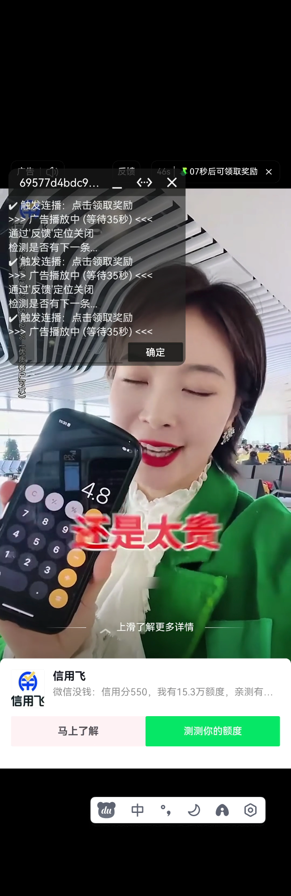

#  简介
&emsp;&emsp;上次看了豆包手机的发布，一直想的豆包手机能不能搞自动化，让我免费领取qs的广告。趁着元旦没啥事，研究了研究。

# 特别说明
&emsp;&emsp;hamibot只支持安卓设备，且无需手机root。

# 快速开始
1、hamibot如何安装使用，官网有介绍。https://docs.hamibot.com/guide/pairing-hamibot

2、把js代码扔到源码里，点击运行

# 效果图

