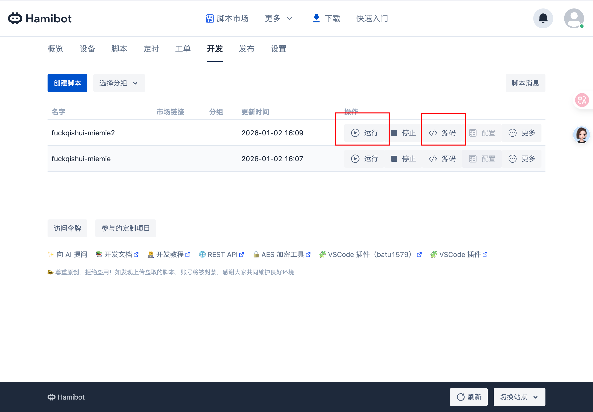

# 汽水音乐任务自动化脚本

这是一个基于 Hamibot / Auto.js 的 Android 自动化脚本，用来验证移动端 App 任务流程的自动化能力。脚本以汽水音乐的「我的」页任务入口为示例，自动完成进入任务、等待广告、关闭广告、领取奖励和状态恢复等步骤。

项目重点是把一个真实 App 中经常变化的任务流程拆成可执行的自动化逻辑：通过控件文本识别主要入口，通过相对坐标处理广告页关闭，通过状态判断处理连续奖励、退出确认和任务完成。

## 分支说明

本项目采用以下分支策略，方便管理和使用：

| 分支 | 说明 |
|------|------|
| `main` | 最新版本的稳定版，始终代表当前最可靠的代码。 |
| `dev` | 开发分支，新功能和修复先在此分支验证，稳定后再合并到 `main`。 |
| `19.1.0` 等版本分支 | 对应汽水音乐具体版本的稳定版脚本，如 `19.1.0` 分支仅适配汽水音乐 19.1.0 版本。 |

建议根据你安装的汽水音乐版本选择对应分支；如果不确定，优先使用 `main` 分支。

## 功能特性

- 自动等待 Hamibot 无障碍服务启动；
- 启动汽水音乐并尝试回到「我的」页面；
- 识别「继续领」「领时长」等任务入口并开始任务；
- 按广告播放时长等待 35 秒后尝试关闭；
- 通过「反馈」控件或右上角相对坐标关闭广告页；
- 检测「领取奖励」并支持连续广告任务；
- 关闭广告后仍停留在广告奖励页时，自动点击奖励区域并继续下一轮；
- 检测「坚持退出」并完成退出确认；
- 检测「更多直播」页面并自动退出；
- 检测「恭喜获得第30日畅听」后结束脚本并返回桌面；
- 找不到入口时自动检查当前页面状态，避免脚本卡死。

## 实现思路

脚本运行后会先确认当前页面是否处在可继续执行的状态。如果页面上已经存在「继续领」或「我的」，则直接进入主循环；否则启动汽水音乐，等待页面加载，并尝试点击「我的」入口。

主循环中，脚本会持续查找「继续领」或「领时长」按钮。找到后点击进入广告任务，然后进入广告处理流程：等待固定播放时间，尝试关闭广告，判断是否出现奖励弹窗。如果出现「领取奖励」，脚本会继续下一轮；如果出现「坚持退出」，则确认退出；如果没有新的弹窗，则认为本轮广告流程结束。

```text
启动脚本
  ↓
确认或进入「我的」页面
  ↓
查找「继续领 / 领时长」
  ↓
进入广告任务并等待播放
  ↓
关闭广告或直播页
  ↓
判断领取奖励 / 坚持退出 / 流程结束
  ↓
继续下一轮或结束脚本
```

## 使用环境

- Android 手机；
- Hamibot；
- 已开启无障碍服务；
- 无需 root。

已测试环境：

- 测试手机：华为 Mate40；
- 汽水音乐版本：19.1.0。

Hamibot 配对和安装方式可参考官方文档：<https://docs.hamibot.com/guide/pairing-hamibot>

## 快速开始

1. 在 Android 设备上安装并配置 Hamibot。

2. 将 `index.js` 中的代码复制到 Hamibot 脚本源码中。

3. 确认已授权无障碍服务，并按需授予截图或悬浮窗等运行权限。

4. 在 Hamibot 中运行脚本。



## 效果示例


## 注意事项

- 本项目仅用于学习 Hamibot、Auto.js 和 Android 自动化流程控制；
- App 页面、按钮文案和广告样式可能变化，脚本需要按实际设备和版本调整；
- 坐标点击基于屏幕相对位置，不同分辨率设备上可能需要重新校准；
- 请在合法合规、符合应用服务条款和个人设备授权的前提下使用。

## 联系方式

有问题欢迎联系，加入电报群：

https://t.me/+WmHxS0gyKmU3NGQ1

## 更新日志

### v1.0.2 (2026-05-01)

- 优化广告奖励页处理：关闭广告后如果仍处于 `ExcitingVideoActivity`，会盲点奖励区域并继续下一轮；
- 调整广告流程循环：最终未检测到奖励页或退出页时不再 `break`，继续尝试处理后续广告；
- 增加「领取奖励」按钮的多方式查找与兜底点击逻辑，兼容文本、描述、正则匹配和坐标点击；
- 更新运行提示语，明确异常状态下会持续尝试广告流程；
- `.gitignore` 新增忽略 `.omx/` 和 `.agents/` 本地运行目录。

### v1.0.1 (2026-03-28)

- 新增直播间自动退出逻辑，当检测到「更多直播」按钮时自动关闭。

### v1.0.0 (2026-01-02)

- 发布初始版本。
